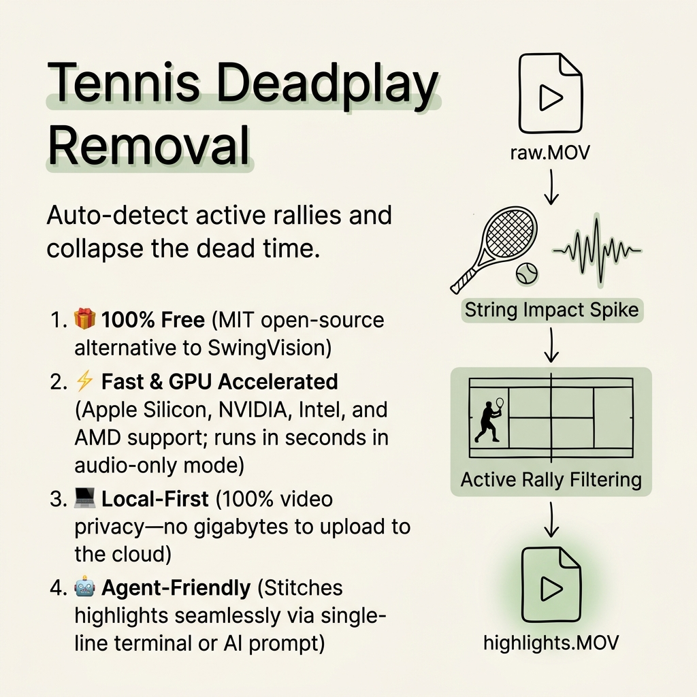

# Tennis Deadplay Removal

**Your 45-minute match has about 9 minutes of actual tennis. This finds it.**



Raw tennis footage is 80% dead time — ball retrieval, rest between points, walking to the net, waiting for the next serve. This tool watches the video, finds the racket impacts, and stitches only the rallies into a seamless highlight reel.

Works on any camera (iPhone, GoPro, DJI, Android), any OS (Mac, Windows, Linux).

## How it works

1. Listens for the *thwack* — ball hitting racket strings has a very specific audio spike
2. Tracks movement between frames — you move during rallies, not between them
3. Groups hits into rallies, pads each point with the serve and follow-through, removes everything else

## Who this is for

- Anyone who records matches and doesn't want to spend an hour in iMovie
- Parents filming kids' tournaments — three hours of footage down to half an hour of actual play
- Coaches analyzing form — skip the walking, see the hits
- Players who want clips without frame-by-frame manual trimming

## What you get

- **GPU acceleration** — auto-detects Apple Silicon, NVIDIA, Intel, AMD. Runs in seconds in audio-only mode.
- **Auto color** — iPhone HDR footage comes out looking right, not washed out. Sets the right bitrate for 4K vs 1080p, HDR vs SDR.
- **Tunable** — one knob for court noise (loud adjacent court? raise the threshold), one for rally gap tolerance.
- **Cross-platform** — one command on Mac, Windows, Linux. Apple devices play the output natively.

## Quick start

```bash
pip install numpy matplotlib
python3 scripts/tennis_deadplay_removal.py raw_match.MOV highlights.MOV
```

Output lands as a playable H.265 file.

## Faster processing

Skips visual analysis — runs in ~2 seconds:

```bash
python3 scripts/tennis_deadplay_removal.py raw.MOV out.MOV --no-motion
```

Full options in [SKILL.md](SKILL.md).

## Notes

- Designed for **tennis** — badminton and pickleball have different audio signatures
- Single-camera footage only
- Best with a stationary camera (tripod, fence mount, bleacher seat)

## License

MIT.