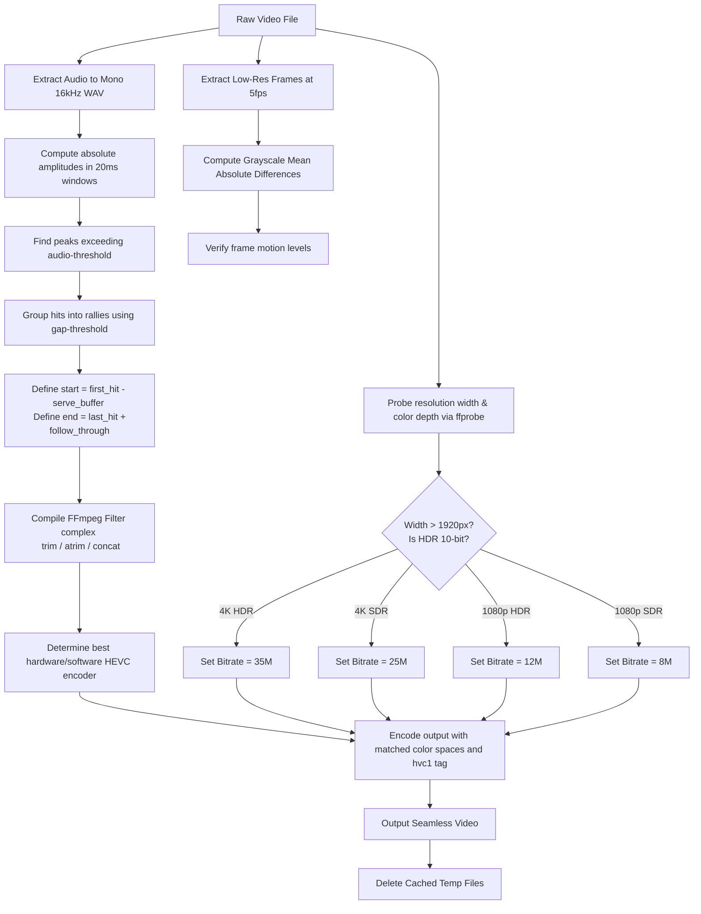

# Tennis Deadplay Removal

This skill provides an automated pipeline to clean raw tennis footage from any camera brand (iPhone, DJI, GoPro, Android) on macOS or Linux. It automatically extracts active play (racket swings and rallies) and cuts out dead moments (e.g. ball-retrieval, rest breaks, waiting between serves).

It uses a multi-factor analysis:
1. **Audio Peaks:** Finds sudden transient volume spikes caused by tennis ball-racket string bed impacts.
2. **Visual Motion:** Computes grayscaled Mean Absolute Differences (MAD) between low-resolution frame samples to track active player motion.

---

## When to Use

Use this skill when raw tennis match or practice video footage is provided, and the user wants to filter out all inactive intervals (deadplay) such as ball collection, rest periods, and breaks, keeping only active play and rallies.

### Don't use for

- **Badminton / Pickleball / Squash** — different ball-to-racket acoustics and rally cadence. The audio peak detection thresholds are tuned for tennis.
- **Multi-camera productions** — the script watches a single angle. It won't switch between camera feeds.
- **Moving camera footage** (walking with a phone, gimbal panning) — the visual motion analysis thresholds assume a fixed frame.
- **Lecture / presentation video** — dead time removal expects ballistic audio spikes and rapid player motion, not a person standing at a podium.
- **Windows hosts** — Windows support was intentionally removed; publish this skill as macOS/Linux only.

---

## Setup & Prerequisites

Ensure the following tools and libraries are installed on the local system:

*   **CLI Utilities:** `ffmpeg` and `ffprobe` (globally accessible via shell PATH).
*   **Python Libraries:** `numpy` (required), `matplotlib` (optional — required for motion analysis; used for `plt.imread()` to load JPEG frame data for the MAD computation. Without it, motion analysis is skipped and the script silently falls back to audio-only via a try/except guard. Audio-only still works well, but rally boundaries are less tight.)

To install the required Python libraries:
```bash
pip install numpy matplotlib
```

For details on the dependency chain, graceful degradation paths, and bitrate auto-scale tables, see `references/dependency-chain.md`.

---

## Procedure

Run the packaged helper script to process raw tennis video:

```bash
python3 SKILL_DIR/scripts/tennis_deadplay_removal.py <input_video> <output_video> [options]
```

### Options Reference

| Argument | Default | Description |
| :--- | :--- | :--- |
| `input` | *Required* | Path to the raw source video file (supports `.MOV`, `.MP4`, `.MKV`, etc.). |
| `output` | *Required* | Path where the edited video will be saved. |
| `--temp-dir` | `temp_tennis_edit` | Temporary directory used for audio extraction and frame caching. |
| `--gap-threshold` | `7.5` | Maximum gap (in seconds) between two consecutive ball hits to consider them part of the same rally. |
| `--audio-threshold` | `0.35` | Volume sensitivity threshold (0.0 to 1.0) to filter background noise from racket strikes. |
| `--serve-buffer` | `2.5` | Time (in seconds) added *before* the first hit of a rally to capture the serve or ball-feeding motion. |
| `--follow-through` | `1.5` | Time (in seconds) added *after* the last hit of a rally to capture the follow-through and point conclusion. |
| `--no-motion` | `False` | Skip visual motion analysis. Blazing-fast fallback that processes audio-only, completing in ~2 seconds. |
| `--cpu-only` | `False` | Force software CPU-only encoding fallback (`libx265`). Useful on servers, virtual machines, or environments without dedicated GPU drivers. |

### Example Command

Process a raw GoPro SDR video in fast audio-only mode on a Linux server:

```bash
python3 SKILL_DIR/scripts/tennis_deadplay_removal.py raw_gopro.MP4 output.MP4 --no-motion --cpu-only
```

---

## Underlying Logic & Auto-scaling

The script performs the following internal operations:



### Hardware Support Matrix

The script programmatically queries drivers and dynamically adjusts codec options:

| Host OS | Active GPU | HEVC Hardware Encoder | Software Fallback (CPU-only) |
| :--- | :--- | :--- | :--- |
| **macOS** | Apple Silicon (M1/M2/M3/M4) | `hevc_videotoolbox` | `libx265` |
| **Linux** | NVIDIA GeForce / RTX | `hevc_nvenc` | `libx265` |
| **Linux** | Intel Core (Integrated / Arc) | `hevc_qsv` | `libx265` |

---

## Pitfalls & Troubleshooting

> [!IMPORTANT]
> **Video Compatibility across Platforms**
> By default, standard FFmpeg HEVC encodes use the container tag `hev1`, which Apple devices (iPhone, iPad, macOS Finder, QuickTime Player) reject. The script automatically forces the Apple-native `-tag:v hvc1` tag on all platforms, guaranteeing cross-device sharing.

*   **Audio from adjacent courts triggering false cuts?**
    If surrounding courts are very loud, adjust the audio threshold to focus strictly on your hits:
    ```bash
    python3 SKILL_DIR/scripts/tennis_deadplay_removal.py raw.MOV output.MOV --audio-threshold 0.45
    ```
*   **Washed-out colors on HDR/iPhone videos?**
    Ensure you are using the default hardware mode or software mode without the `--cpu-only` flag unless necessary. The script automatically maps Apple HLG Rec.2020 parameters (`-pix_fmt p010le -color_primaries bt2020 -color_trc arib-std-b67 -colorspace bt2020nc`) to keep color saturation perfect.

*   **Flickering output with hardware acceleration?**
    `hevc_videotoolbox` (Apple Silicon hardware encoder) can produce intermittent brightness flicker on 10-bit HDR footage, especially at concat-stitched segment boundaries. If you see flickering:
    - Re-run with `--cpu-only` to use software `libx265` — this eliminates the flicker but runs ~5x slower.
    - The flicker is a known VideoToolbox issue; see `references/encode-tradeoffs.md` for more details and potential encoder param workarounds.

For detailed timing comparisons, keyframe-snapping tradeoffs, and the `-c copy` concat fast-path approach, see `references/encode-tradeoffs.md`.

---

## One-Shot Recipes

### Default: audio-only on clean iPhone HDR footage (recommended)

For most iPhone HDR footage with clear ball-strike audio, motion analysis is redundant — the audio peaks already capture every rally correctly. Skip it to save ~8s of analysis time with zero quality difference.

```bash
python3 SKILL_DIR/scripts/tennis_deadplay_removal.py IMG_1234.MOV out.MOV --no-motion
```

### Loud adjacent court (raise audio threshold)

```bash
python3 SKILL_DIR/scripts/tennis_deadplay_removal.py match.MOV out.MOV --audio-threshold 0.50
```

If the net-cam is picking up the next court's hits, bump the threshold so only your court's strikes register.

### Doubles with short rallies (tighten gap threshold)

```bash
python3 SKILL_DIR/scripts/tennis_deadplay_removal.py match.MOV out.MOV --gap-threshold 5.0
```

Doubles rallies are shorter and more frequent. Lower gap threshold prevents merging separate points.

### Server-side batch processing (no GPU, no display)

```bash
python3 SKILL_DIR/scripts/tennis_deadplay_removal.py raw.MP4 out.MP4 --no-motion --cpu-only
```

For headless Linux servers or VMs without GPU drivers. Forces software H.265 encoding.

---

## Verification Checklist

After running the script, confirm:

- [ ] Output file exists at the requested path
- [ ] Output video plays in the target player (QuickTime, VLC, browser)
- [ ] Duration is roughly 15-25% of the input (active play only; adjust thresholds if too much dead time remains)
- [ ] Rallies are not cut off mid-point (if they are, increase `--serve-buffer` or `--follow-through`)
- [ ] Adjacent points are not being merged (if they are, decrease `--gap-threshold`)
- [ ] Colors look right (iPhone HDR footage should not be washed out; if it is, remove `--cpu-only`)
